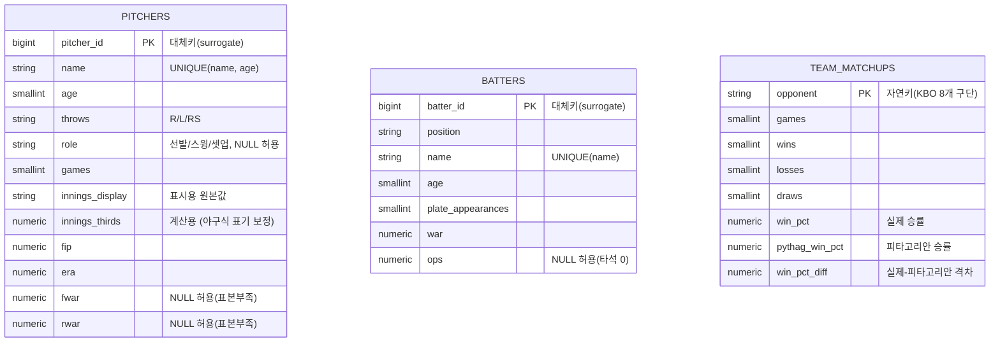

# 삼성 라이온즈 2025 스탯 저장시스템

hardhit.ai에서 내려받은 CSV 3개(투수/타자/상대전적)를 PostgreSQL(`lionsdb`)에 적재하는 저장시스템.
Steam 프로젝트와 동일한 SQLAlchemy ORM + upsert 패턴을 사용한다.

| 파일 | 설명 |
|---|---|
| `models.py` | pitchers / batters / team_matchups 3개 테이블 모델 |
| `database.py` | DB 연결과 테이블 생성 |
| `loader.py` | CSV 정제(BOM/화살표/`-`/이닝표기/전적분해) + 적재 |
| `verify.py` | 완전성 / NOT NULL / 중복 / 이상치 검증 |
| `pipeline.py` | 통합 실행 |

---

## 원본 데이터 이슈와 정제

hardhit.ai에서 내려받은 CSV 3개에는 다음과 같은 정제가 필요한 지점이 있었다.

1. **UTF-8 BOM** — 파일 맨 앞에 BOM이 붙어 있어 `encoding='utf-8-sig'`로 읽어야 첫 컬럼명이 깨지지 않는다.
2. **헤더에 정렬 화살표 혼입** — `fWAR ↓`, `WAR ↓`, `승률 ↓`처럼 사이트 UI의 "현재 정렬 기준" 표시가 헤더 문자열에 그대로 포함되어 있었다. `loader.py`에서 컬럼명의 ` ↓`를 제거하고 사용한다.
3. **`-` = 결측치** — 표본이 너무 작아 계산 불가능한 값(`K/BB`, `fWAR`, 타석 0인 선수의 비율스탯 등)은 숫자 대신 `-` 문자열로 표시되어 있다. 그대로 형변환하면 에러가 나므로 NaN(NULL)으로 치환 후 처리한다.
4. **`이닝` 컬럼은 일반 소수가 아니다** — 야구의 이닝 표기는 `.1`=1아웃(1/3이닝), `.2`=2아웃(2/3이닝)을 의미한다. `197.1`이닝은 197.1이 아니라 197과 1/3이닝(≈197.333)이다. 원본 표시값(`innings_display`)은 그대로 보존하고, 계산에 쓸 정확한 실수값(`innings_thirds`)을 별도 컬럼으로 만들었다.
5. **`전적` 컬럼이 복합 문자열** — `"186-101-80-5"`(경기-승-패-무) 하나에 값 4개가 뭉쳐 있어 `games`/`wins`/`losses`/`draws` 4개 컬럼으로 분해했다.
6. **이름은 자연키가 아니다** — `pitchers` 원본에 **동명이인 '이승현'** 이 2명 존재한다 (23세·좌완·선발 / 34세·우완·셋업, 완전히 다른 선수). `이름`만으로 기본키를 잡았다면 한 명이 조용히 사라졌을 것이다. 이 사고를 막기 위해 대체키(surrogate id)를 PK로 쓰고, `(name, age)` 조합에 `UNIQUE` 제약을 걸었다.

---

## ERD



`pitchers`/`batters`/`team_matchups`는 서로 외래키로 연결되지 않는 독립 테이블이다 (선수 스탯과 팀 상대전적은 별개 집계 단위).

---

## 중복 방지 전략

- **team_matchups**: `opponent`(상대팀명)가 진짜 자연키 → `INSERT ... ON CONFLICT (opponent) DO UPDATE` (merge)
- **pitchers**: 이름이 자연키가 아님(동명이인 존재) → 대체키 PK + `UNIQUE(name, age)` + `ON CONFLICT (name, age) DO UPDATE`
- **batters**: 이번 시즌엔 이름 중복이 없었지만, 다음 시즌 데이터를 추가할 때도 안전하도록 pitchers와 동일하게 대체키 + `UNIQUE(name)` 방식을 쓴다.

---

## 실행

```bash
pip install sqlalchemy "psycopg[binary]" pandas
python pipeline.py
```
