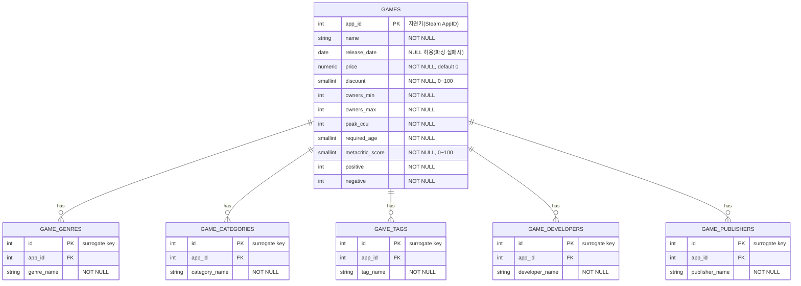

# 빅데이터 저장시스템 개발 - NCS
- 빅데이터 저장모델 설계
- 빅데이터 적재모듈 개발

---
## Steam 게임 데이터(Kaggle) 저장 시스템 실습

| 파일명 | 설명 |
|---|---|
|`models.py` | SQLAlchemy 테이블 모델 정의 (games + 자식 테이블 5개) |
|`database.py` | DB 연결과 테이블 생성 |
|`loader.py` | CSV 컬럼 보정 + 배치 적재 |
|`verify.py` | 검증. 완전성/NULL/이상치/중복/참조무결성 조사 |
|`pipeline.py` | 통합 실행 |
|`README.md` | 실행 방법과 설계 설명(ERD 포함) |

---

### pgAdmin(or psql)에서 데이터베이스 준비
```sql
CREATE DATABASE gamesdb;
```
`database.py`의 `DB_URL`을 본인 PostgreSQL 계정/비밀번호에 맞게 수정한다.

---

### 입력 파일 준비

| 폴더 | 필요한 파일 |
| --- | --- |
| `steam_games/input/` | `games.csv` (Kaggle Steam Games Dataset) |

- csv 인코딩은 `utf-8-sig` 기준

---

### 실행

```bash
pip install sqlalchemy psycopg2-binary pandas
cd steam_games
python pipeline.py
```

---

## ⚠️ 원본 데이터 이슈: 컬럼 밀림 현상

`games.csv`를 그대로 `pandas.read_csv()`로 읽으면, **헤더는 39개인데 실제 데이터는 행마다 40개 필드**가 들어있어 컬럼명이 전부 한 칸씩 밀려서 매핑된다.

- 원인: 원본 헤더의 `DiscountDLC count`라는 항목이, 원래 `Discount`와 `DLC count` 두 개의 컬럼이었는데 헤더 한 칸이 유실되며 하나로 합쳐진 것으로 추정됨.
- 증상: pandas는 "헤더 수(39) < 데이터 필드 수(40)"인 경우 첫 번째 데이터 값을 인덱스로 취급하고, 나머지 39개 데이터 필드를 헤더 39개에 순서대로 매핑한다. 그 결과 `AppID` 컬럼에 실제로는 게임 제목이, `Name` 컬럼에는 출시일이 들어가는 등 **전체 컬럼이 한 칸씩 밀려서** 읽힌다.
- 해결: `loader.py`에서 `header=None, skiprows=1` + 직접 정의한 40개 컬럼명(`CORRECT_COLUMNS`, `Discount`/`DLC count` 분리)으로 명시적으로 지정해서 읽는다.
- 검증: 보정 후 `AppID`는 결측 1건(2개 중 이름도 없는 행 1건, 아래 참고), 중복 0건으로 정상적인 자연키임을 확인함.
- 참고: `Name`이 비어있는 행이 1건 존재하여(app_id=396420), `games.name`이 `NOT NULL`이므로 적재 대상에서 제외한다. (원본 125,855행 -> 유효 125,854행)

---

## ERD (Entity Relationship Diagram)



### 설계 설명

#### games (메인 테이블)
> 원본 39(사실상 40)개 컬럼 중, 게임의 핵심 특성(제목/출시일/가격/할인율/추정소유자수/동접자/연령등급/평점/리뷰)만 선별하여 12개 컬럼으로 구성했다.
> `AppID`는 Steam이 게임마다 부여하는 고유 식별자로 이미 값 자체가 유일(자연키) 하므로, 별도의 대체키(surrogate id) 없이 그대로 기본키(PK)로 사용한다.

#### 1:N 자식 테이블 (game_genres / game_categories / game_tags / game_developers / game_publishers)
> 원본 CSV의 `Genres`, `Categories`, `Tags`, `Developers`, `Publishers` 컬럼은 한 셀에 콤마(,)로 여러 값이 들어있는 다중값 컬럼이다. (예: `Genres = "Action,Early Access"`)
> 정규화를 위해 각각 별도 테이블로 분리했다. 이 자식 테이블들은 자기 자신만으로는 자연키가 없으므로, 일련번호(`id`)를 대체키(PK)로 쓰고 `(app_id, 이름)` 조합에 `UNIQUE` 제약을 걸어 같은 게임에 같은 값이 중복 적재되지 않도록 했다. `app_id`는 `games.app_id`를 참조하는 외래키(FK, `ON DELETE CASCADE`)다.

#### 중복 방지 전략
> - **games**: `app_id`가 자연키이므로 `INSERT ... ON CONFLICT (app_id) DO UPDATE`(merge/upsert) 방식을 사용한다. 이미 적재된 게임이면 값을 최신화하고, 없으면 새로 삽입한다.
> - **자식 테이블 5종**: 자연키가 없으므로 `(app_id, 이름)` `UNIQUE` 제약 + `ON CONFLICT DO NOTHING` 방식을 사용한다. 이미 있는 조합이면 조용히 건너뛴다.

#### 검증 설명
> `verify.py`가 다음을 SQL로 직접 확인한다.
> 1. 완전성: 원본 CSV 유효 행수(Name 결측 제외) == DB `games` 건수
> 2. `games` 필수 컬럼 NULL 여부
> 3. 이상치: 가격/리뷰수 음수, 할인율·메타크리틱 점수 범위(0~100) 이탈, `owners_min > owners_max`
> 4. 자식 테이블 업무 키(`app_id` + 이름) 중복 여부
> 5. 자식 테이블 -> `games` 참조 무결성 여부
